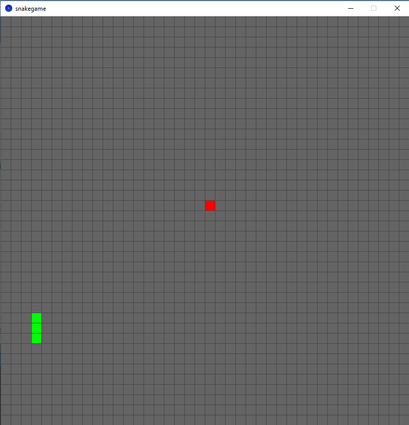

# snakegame
The Snake game implemented with Pocessing (Python mode)

## Usage
- 1 - Press '1' key to start new game
- p - Press 'p' to pause the game
- use LEFT|RIGHT|UP|DOWN keys to rotate the snake. Or you can use WASD keys.

## Screenshots

